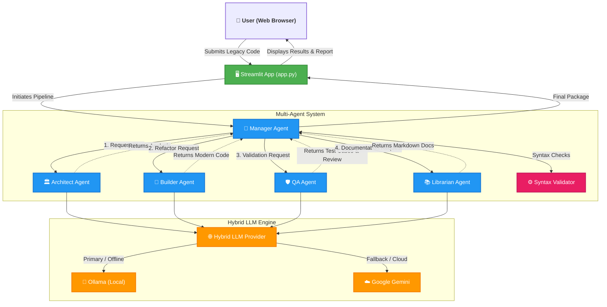

<div align="center">
  <h1>🚀 A2A Code Modernizer</h1>
  <p><strong>Driven by a Distributed Agent-to-Agent Architecture with Local & Cloud LLM capabilities</strong></p>
  
  [](https://www.python.org/downloads/)
  [](https://streamlit.io/)
  [](https://ollama.ai/)
  [](https://ai.google.dev/)
</div>

---

## 📖 Overview

**A2A Code Modernizer** is an intelligent, multi-agent AI system designed to automatically analyze, refactor, test, and document legacy Python codebase. Built around a robust Agent-to-Agent (A2A) paradigm, it uses specialized AI agents that collaborate sequentially, implementing self-healing workflows to guarantee syntactically valid and highly optimized code generation.

The system natively operates using local LLMs (via **Ollama**) for absolute data privacy and offline capability, with seamless fallback capabilities to cloud-based models (via **Google Gemini**) for rapid experimentation.

---

## ✨ Key Features

- **Multi-Agent Orchestration**: Specialized roles (Architect, Builder, QA, Librarian) handle distinct phases of the software modernization lifecycle.
- **Self-Healing Loop**: The `ManagerAgent` detects syntax errors and logical flaws in generated code, automatically prompting agents with context-aware error feedback until the code is valid.
- **Hybrid LLM Provider**: Run entirely offline using `qwen2.5-coder:3b` via Ollama, or switch to the cloud with `gemini-3-flash-preview` if local resources are insufficient.
- **Interactive Web UI**: A clean, responsive Streamlit interface that compares legacy vs. modernized code, runs test cases inline, and enables one-click full markdown report exports.

---

## 🏗️ Architecture & Workflow

The system relies on a central `ManagerAgent` orchestrating four specialized agents. Each agent queries the `HybridLLMProvider`, which routes requests intelligently between local and cloud AI models.



---

## 🛠️ Technology Stack

- **Frontend**: [Streamlit](https://streamlit.io/) for rapid prototyping of the interactive GUI.
- **AI/LLM Backends**:
  - Local runtime managed by `ollama-python`.
  - Cloud integration handled via `google-generativeai`.
- **Validation Mechanics**: Python `ast` parsing for instant code syntax validation.

---

## 📁 Project Structure

```text
a2a_code_modernizer-main/
│
├── app.py                  # Main Entry Point (Streamlit UI)
├── config.py               # Global configuration parameters
├── requirements.txt        # Python package dependencies
│
├── core/                   # Core application architecture
│   ├── llm_provider.py     # Fallback system (Local -> Cloud)
│   ├── model_manager.py    # Auto-downloader for local models
│   └── protocol.py         # Standard Pydantic schemas (TaskResult)
│
├── agents/                 # Intelligent AI Agent Definitions
│   ├── manager.py          # Orchestrator & Self-Healing Loop
│   ├── base_agent.py       # Core agent inheritance setup
│   ├── architect.py        # Planner & architectural analysis
│   ├── builder.py          # Code refactoring engine
│   ├── qa.py               # Test-case generator & logic reviewer
│   └── librarian.py        # Technical documentation generator
│
└── utils/                  # Helper modules
    └── validators.py       # AST-based syntax error checking
```

---

## 🚀 Installation & Setup

### 1. Prerequisites

- Python 3.9 or higher.
- [Ollama](https://ollama.com/) (Required only if running in Local Mode).
- A virtual environment is highly recommended.

### 2. Clone the Repository

```bash
git clone https://github.com/your-repo/a2a_code_modernizer.git
cd a2a_code_modernizer
```

### 3. Set Up Virtual Environment

```bash
python3 -m venv spiderman   # Assuming built-in venv is named 'spiderman'
source spiderman/bin/activate
# Windows: spiderman\Scripts\activate
```

### 4. Install Dependencies

```bash
pip install -r requirements.txt
```

### 5. Mode-Specific Setups

**For Local AI Mode (Ollama):**
Ensure Ollama is running on your machine:
```bash
ollama serve
```
*(Note: The app will automatically pull `qwen2.5-coder:3b` if you do not have it installed!)*

**For Cloud AI Mode (Gemini):**
You can set your environment variable or type it when prompted in the Streamlit UI:
```bash
export GEMINI_API_KEY="your-google-gemini-api-key"
```

---

## 🎮 Usage

Launch the modernizer toolkit by running:

```bash
streamlit run app.py
```

1. **Select Mode:** Choose between Local (Ollama) or Cloud (Gemini) on the sidebar.
2. **Submit Code:** Paste your legacy script.
3. **Execute:** Click "Run Modernization Pipeline".
4. **Interact:** View the real-time execution timeline as the Manager talks to the Architect, Builder, QA, and Librarian.
5. **Analyze & Export:** Compare the code side-by-side, run individual auto-generated test cases, and click "Download Full Report" when finished.

---

## 🤝 How to Contribute

Contributions are what make the open-source community such an amazing place to learn, inspire, and create. Any contributions you make are **greatly appreciated**.

Here's how you can help:

1. **Fork the Project**
2. **Create your Feature Branch:**
   ```bash
   git checkout -b feature/AmazingFeature
   ```
3. **Commit your Changes:**
   ```bash
   git commit -m "Add some AmazingFeature"
   ```
4. **Push to the Branch:**
   ```bash
   git push origin feature/AmazingFeature
   ```
5. **Open a Pull Request** discussing what changes you made.

**Suggestions for Contributions:**
- Adding a new specialized agent (e.g., `Security Agent`).
- Extending the LLM Provider to support OpenAI, Anthropic, or HuggingFace.
- Enhancing AST-based validations.

---

> **Disclaimer:** This tool uses AI to generate code. While it implements a self-healing loop and strict syntax checking, all modernized code should be manually verified by a human developer before deployment to mission-critical production systems.

<div align="center">
  <i>Modernizing code, one intelligently-orchestrated agent at a time.</i>
</div>
